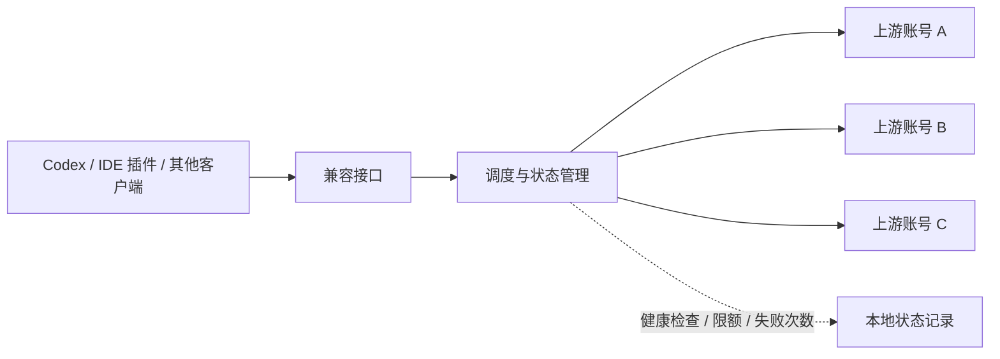

# “日抛号池”是什么？原理、代价与风险

> [!WARNING]
> 本文只讨论“日抛号池”的概念、技术结构和风险，不提供异常建号、接码绕过、支付绕过或平台风控规避教程。对于长期使用、重要项目或敏感数据，优先选择官方订阅或官方 API。

“日抛号”不是任何平台的官方产品名称，而是二级市场中的俗称。它通常指价格较低、来源和所有权不稳定、预期寿命较短，并且可能随时失效的订阅账号。

所谓“日抛”不一定真的只能使用一天，也不代表至少能稳定使用一天。它描述的是一种**高风险、低保障、寿命不可预测**的账号形态。

---

## 结论速览

| 问题 | 简短回答 |
| --- | --- |
| 日抛号一定能用一天吗？ | 不一定，可能几分钟失效，也可能存活更久。 |
| 组成账号池后会更稳定吗？ | 只能提高短期可用概率，不能消除账号本身的风险。 |
| 自动切号是无缝的吗？ | 不是，可能影响会话、缓存、工具调用和流式输出。 |
| 兼容接口等于官方 API 吗？ | 不等于，它通常只是额外增加的一层协议适配和请求转发。 |
| 是否需要接码 | 除了gork之外大部分号使用都需要接码，但是可以开启2fa验证，不用担心号码丢失而无法登陆 |

> [!IMPORTANT]
> 账号池不是把多个高风险账号“变成一个稳定账号”，而是尝试用多个不确定的上游，换取一段相对连续的可用时间。

## 1. 为什么会出现“日抛号”？

这类账号可能因为以下原因失效：

- 原持有人找回账号；
- 支付撤销、拒付或订阅状态变化；
- 团队、教育等资格被重新审核；
- 多人共享、跨地区登录或其他异常登录行为；
- 账号来源、所有权或付款方式不合规；
- 平台调整认证、限额或风控规则。

二级市场价格会随供货渠道、平台政策和市场供需快速变化。某个地区或付款渠道短期出现价格优势，并不代表账号来源可靠，也不代表这种价格能够持续。

因此，不建议把日抛号当成官方订阅的长期替代品。个人长期使用时，正规订阅或官方 API 通常更可控，也更容易明确数据、费用和账号责任边界。

## 2. 账号池是怎样工作的？

从技术结构看，一个账号池通常包含三层：



### 上游账号

账号之间通常具有不同的订阅权限、剩余额度、并发限制和限速状态，也是整个系统中最不稳定的一层。

### 调度程序

调度程序保存账号状态并检测可用性，再按照轮询、剩余额度、并发数量或失败次数，将请求分配给不同上游。

### 兼容接口

兼容接口把多个账号包装成一个统一地址，让 Codex、IDE 插件或其他客户端看起来像是在访问同一个服务。

Cockpit Tools、Sub2API 等工具都属于这一类方案，区别主要在部署方式、界面和调度能力。我建议Cockpit Tools即可，Sub2API有的需要 Docker 环境。

> [!CAUTION]
> 工具显示“OpenAI 兼容接口”，只表示请求格式可能兼容，并不表示它是 OpenAI 官方 API，也不代表其认证、计费、数据处理或稳定性与官方服务相同。

## 3. 自动切号会损失什么？

自动切号的主要价值是减少手动登录：当一个账号触发限额、失效或请求失败时，调度器可以尝试切换到另一个账号。但这种切换并非完全无损。

| 影响维度 | 可能出现的问题 |
| --- | --- |
| 会话状态 | 对话标识或服务端状态可能绑定原账号，切换后无法完整继承。 |
| 上下文连续性 | 调度器重新组织请求或截断上下文时，前后结果可能不一致，这个可以使用Cockpit Tools管理和恢复。 |
| Prompt Cache | 请求前缀、模型、缓存键或路由变化后，缓存命中率可能下降，账号轮询主要影响这个。 |

### 关于 Prompt Cache

不能简单地认为“只要切号就一定丢缓存”。缓存能否命中通常取决于请求前缀、模型、缓存参数、上下文处理方式和具体上游实现。

但如果中转系统改变了请求格式、模型路由、缓存键或会话上下文，命中率确实可能下降。在支持缓存计费的官方 API 场景中，缓存输入与普通输入的成本可能不同，因此长上下文编码任务会更加在意缓存稳定性。

换句话说，账号池提供的是**尽量连续的可用性**，而不是严格意义上的无缝切换。

## 4. 二级市场常见的账号标签

下面这些名称主要来自卖家描述，不是统一、稳定的官方规格。具体权限、额度、限制和价格会随时间变化，购买页面上的宣传也不应直接视为保证。

* Free，即免费账号，约5美元左右额度，无法使用最新的sol，但是gork家可以自行进行邮箱接码使用，GitHub上有公开的脚本；
* Plus，即个人付费订阅，Plus 有100多刀额度，正价开通有ios渠道和谷歌渠道，有时因为汇率可以比较便宜的买到，比如最近的玻利维亚渠道plus可以80+买到，可以多关注一下；
* bugteam/Team，有240至250美元额度；
* K12，16到20刀左右，有5h限制。
* pro*5 或 *20，这种日抛比较少见，更多的时用在中转站上，价格也比较贵，但是可以有时因为汇率可以比较便宜的买到，比如最近的玻利维亚渠道，可以多关注一下。 

> [!NOTE]
>以上均需要接码使用codex（正价plus和pro不一定，k12最近限制接码了）

## 5. 为什么价格和存活时间不稳定？

这类账号没有规范、透明的定价体系。最终价格和寿命通常受多项因素共同影响：

1. **账号来源与所有权**：能否被原持有人找回，卖家是否真正拥有处置权。
2. **付款与订阅状态**：付款是否最终结算，是否存在撤销、拒付或资格取消。
3. **共享程度**：同时登录人数、并发强度和使用模式是否异常。
4. **平台规则变化**：登录验证、地区政策、资格审核和风控强度都可能调整。
5. **市场供需**：某一渠道中断后，价格可能在短时间内明显波动。
6. **供货层级**：经过的代理层级越多，信息越不透明，售后责任也越难确认。

常见供货链条大致如下：

```text
账号来源方 → 批量供货方 → 代理商 → 零售商 → 最终用户
```

越接近上游，拿货价格理论上可能更低，但风险并不会消失，只是更多地转移给购买者。所谓“渠道稳定”“IP 干净”等市场话术，也不能替代对账号所有权、付款合规性和平台规则的核实。

## 6. 哪些场景不适合使用账号池？

出现以下任一情况，都更适合使用官方渠道：

- 需要长期保存和连续继承会话；
- 正在处理工作资料、代码仓库、客户信息或其他敏感数据；
- 依赖稳定的工具调用、流式输出或长时间编码任务；
- 需要清晰的账单、用量统计、售后和责任边界；
- 无法接受账号突然失效、功能降级或上下文中断；
- 用于团队协作、生产环境或商业交付。

## 7. 我写的货源查询工具

目前部分代理会通过链动小铺发布货源。为了减少重复翻页和手工比价，我写了一款 Windows 桌面工具，主要提供：

- 关键词搜索、价格区间和屏蔽词筛选；
- 售价排序、跨页去重和 CSV 导出；
- 收藏、备注、自定义标签和查询方案；
- 收藏商品最近 3 天的价格曲线；
- 价格、库存和关联状态变化提示；
- 商品关联及关联状态体检。

[](https://github.com/CUy-y/source-browser-desktop)
[](https://github.com/CUy-y/source-browser-desktop/releases/latest)
[](https://github.com/CUy-y/source-browser-desktop)

如果这个工具对你有帮助，欢迎给仓库点一个 Star。

## 免责声明

- 本文不倡导购买或使用来源不明的账号，也不为任何卖家、账号渠道或中转服务背书。
- 文中二级市场名称和现象仅用于解释概念，不代表其真实权益、稳定性或合规性已经得到验证。
- 账号价格、额度、验证方式和平台规则变化很快，文中描述可能随时失效，请勿将其视为购买建议。
- 使用任何第三方账号、调度工具或兼容接口前，请自行核实账号来源、数据处理方式，并遵守相应平台条款和所在地规定。
- 对重要项目和敏感数据，应优先选择身份、计费和数据责任边界清晰的官方服务。
